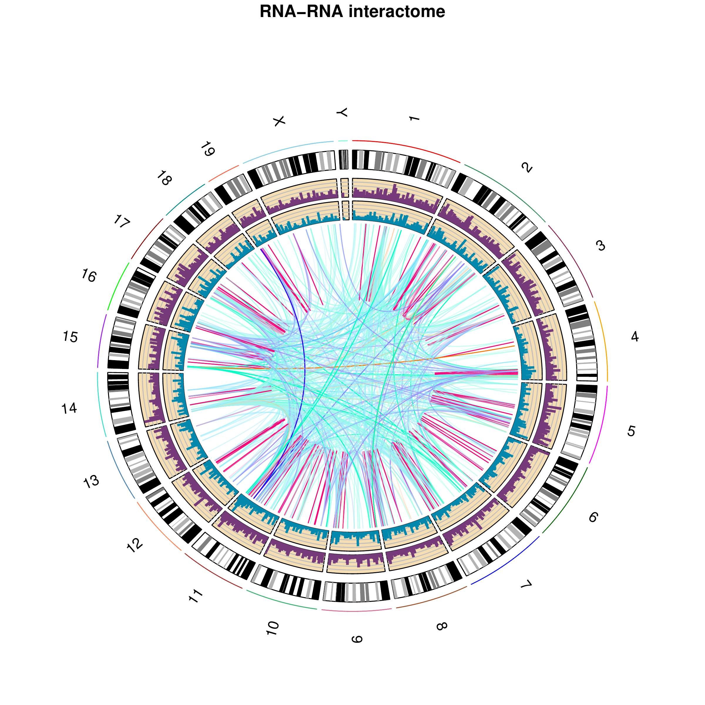
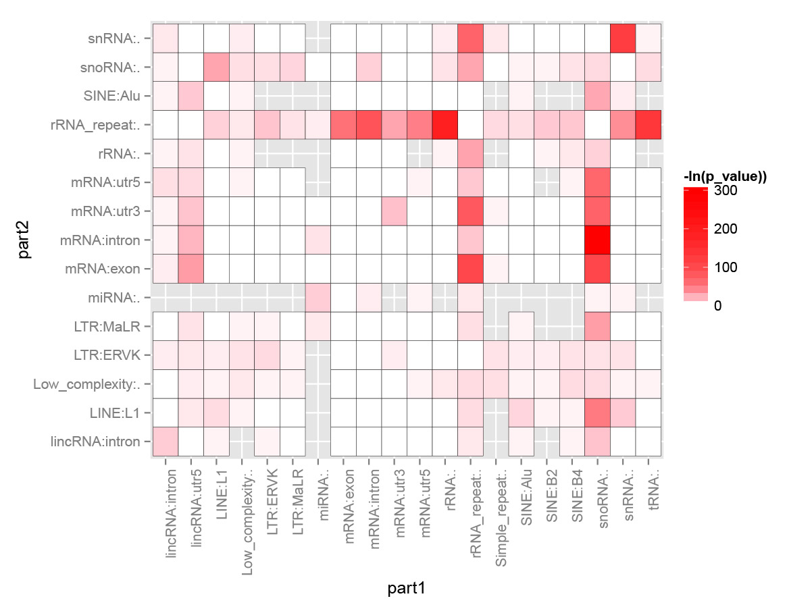

.. _VisualizationLocal:

===========================================
Visualization of local RNA-RNA interactions
===========================================

Prerequirement
--------------

This program require python modules: xplib, matplotlib, numpy, bx-python

.. _plotInteraction:

Run the program to generate visualization
-----------------------------------------
.. index:: Plot_interaction.py

The script "Plot_interaction.py" will be used for this purpose, ::
  
  usage: Plot_interaction.py [-h] [-n N] [-s START [START ...]] [-d DISTANCE]
                             [-g GENEBED] [-w PHYLOP_WIG] [-p PAIR_DIST] [-S]
                             [-o OUTPUT]
                             interaction linkedPair

  plot linked pairs around a given interaction. information of linked pairs are
  stored in file '*_fragment_paired_align.txt'

  positional arguments:
    interaction           Interaction file from output of
                          'Select_strongInteraction_pp.py'
    linkedPair            file for information of linked pairs, which is output
                          of 'Stitch-seq_Aligner.py'

  optional arguments:
    -h, --help            show this help message and exit
    -n N                  Choose region to plot, it can be a number (around n-th
                          interaction in the interaction file). This is mutually
                          exclusive with '-r' option
    -r R [R ...]          Choose region to plot, give two interaction regions
                          with format 'chr:start-end', this is mutually
                          exclusive with '-n' option
    -s START [START ...], --start START [START ...]
                          start column number of the second region in
                          interaction file and linkedPair file, default=(7,8)
    -d DISTANCE, --distance DISTANCE
                          the plus-minus distance (unit: kbp) flanking the
                          interaction regions to be plotted, default=10
    -g GENEBED, --genebed GENEBED
                          the genebed file from Ensembl, default:
                          ../Data/Ensembl_mm9.genebed
    -w PHYLOP_WIG, --phyloP_wig PHYLOP_WIG
                          the bigWig file for phyloP scores,defualt:
                          mouse.phyloP30way.bw
    -p PAIR_DIST, --pair_dist PAIR_DIST
                          two interacted parts within this distance are
                          considered as self-ligated and they are marked or
                          eliminated (see option -s for slim mode), default:
                          200bp
    -S, --Slim            set slim mode to eliminate self ligated interactions
    -o OUTPUT, --output OUTPUT
                          output plot file, can be format of emf, eps, pdf, png,
                          ps, raw, rgba, svg, svgz

.. note::

  linkedPair file is the output \*_fragment_paired_align.txt from :ref:`Step5:Stitch-seq_Aligner.py<Step5>` of the pipeline; Interaction txt file is the output of :ref:`Step6:Select_strongInteraction_pp.py<Step6>`.

Example of result graph
-----------------------

*Example code:* ::

  python Plot_interaction.py 
          ACCT_interaction_clusters_rmrRNA.txt \
          ACCT_fragment_paired_align_rmRNA_sort.txt.gz \
          -n 2412 \
          -d 5 \
          -o local_interaction.pdf
    
*Result figure:*

.. image:: local_interaction_malat1_ACCT.jpg

*Explanation:*

.. raw:: html

 <ul>
 <li> The  blue  blocks are clusters generated in  R1 . And the  red  blocks are clusters generated in  R2 . </li>
 <li> the semi-transparent polygons connecting clusters in R1 and R2 pools indicate different strong interactions between clusters. </li> 
 <li>The lines connecting to regions are evidence of linkedPairs, where  green  lines are the ones with distance between two ends less than what specified in option '-p'. This implies self ligation. All others are colored black </li>
 </ul>

.. _VisualizationGlobal:

===========================================
Visualization of global RNA-RNA interactome
===========================================

Prerequirement
--------------

This program is powered by `RCircos <http://cran.r-project.org/web/packages/RCircos/index.html>`_.

Required R packages (our program will check for the presence of these packages and install/load them automatically if not present):
 
 * argparse, RCircos, biovizBase, rtracklayer 

The program also require a python script "bam2tab.py" (already in /bin/ folder) to call coverage from `BAM2X <https://github.com/nimezhu/bam2x/blob/master/scripts/bed2tab.py>`_

Run the program to generate visualization
-----------------------------------------
.. index:: Plot_Circos.R

We will use the script "Plot_Circos.R" for this purpose. ::
  
  usage: Plot_Circos.R [-h] [-g GENOME] [-b BIN] [-o OUTPUT]
                     interaction part1 part2

  positional arguments:
    interaction           the interaction file,[required]
    part1                 aligned BAM file for part1,[required]
    part2                 aligned BAM file for part2,[required]

  optional arguments:
    -h, --help            show this help message and exit
    -g GENOME, --genome GENOME
                          genome information, choice: mm9/mm10/hg19 et.al.,
                          [default: mm9]
    -b BIN, --bin BIN     window size for the bins for coverage calling, [default: 100000.0]
    -o OUTPUT, --output OUTPUT
                          output pdf file name, [default: Interactome_view.pdf]

.. note::
  
  part1, part2 BAM files are the ones generated from :ref:`Step5:Stitch-seq_Aligner.py<Step5>` of the pipeline; Interaction txt file is the output of :ref:`Step6:Select_strongInteraction_pp.py<Step6>`.

Example of result graph
-----------------------

*Example code:* ::
  
  Rscript Plot_Circos.R GGCG_interaction_clusters.txt 
    sort_Paired1_fragment_GGCG.bam sort_Paired2_fragment_GGCG.bam 
    -b 100000 -o Interactome_GGCG.pdf

*Result figure:*

*Explanation:*

.. raw:: html

 <ul>
 <li>The  purple track right inside chromatin cytoband ideogram is the coverage of part1 (the first genomic regions connected with linker sequences) of this sample.</li> 
 <li>The  light blue track next is the coverage of part2 (the other genomic regions connected with linkers). </li>
 <li>The inner links are the strong interactions after removing rRNA. colors represent different types of interactions and the transparency represents the confidence of the interaction (the ones with lower p-values are stronger) </li>
 </ul>

.. _VisualizationEnrich:

=============================================
Visualization of interaction types enrichment
=============================================

Prerequirement
--------------

Required R packages (our program will check for the presence of these packages and install/load them automatically if not present):

 * "argparse","ggplot2","scales"

Run the program to generate visualization for enrichment of different types of interactions
-------------------------------------------------------------------------------------------
.. index:: Interaction_type_enrichment.R

We will use the script "Interaction_type_enrichment.R" for this purpose. ::

 usage: ../../bin/Interaction_type_enrichment.R [-h] [-n NUM [NUM ...]]
                                                 [-o OUTPUT]
                                                 interaction

  plot the statistical significance for enrichment of different interaction
  types
  
  positional arguments:
    interaction           the strong interaction file,[required]
  
  optional arguments:
    -h, --help            show this help message and exit
    -n NUM [NUM ...], --num NUM [NUM ...]
                          Column numbers for the type name in two part,[default:
                          [4, 11]]
    -o OUTPUT, --output OUTPUT
                          output pdf figure file, [default:
                          interaction_type.pdf]
  
.. note::

  Interaction txt file is the output of :ref:`Step6:Select_strongInteraction_pp.py<Step6>`.

Example of result graph
-----------------------

*Example code:* ::

  Rscript Plot_Circos.R ACCT_interaction_clusters.txt
    -n 4 11 -o ACCT_interaction_type.pdf

*Result figure:*

*Explanation:*

For each interaction types (Type1_in_Part1<->Type2_in_Part2), we calculated the number of Type1 in Part1 from all intereactions ``n1`` and number of Type2 in Part2 from all interactions ``n2``. Then we calculate the number of interactions with this type: Type1_in_Part1<->Type2_in_Part2 ``n12``. The p-value for each interacction type is calculated based on the hypergeometric distribution with R command: ``phyper(n12, n1, total_n - n1, n2, lower.tail=F)``. Here ``total_n`` is the total number of strong interactions. The color for each cell (each interaction type) are coded based on the value of "-ln(p-value)".

